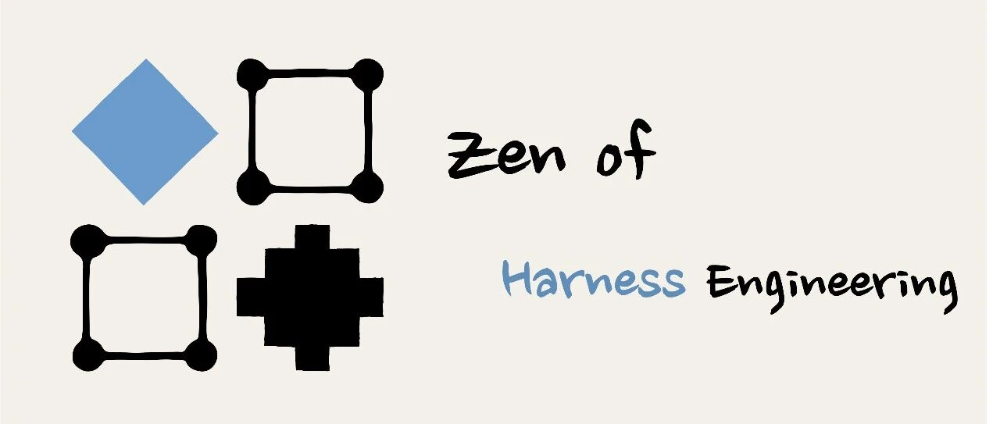

# 把 Claude Code 源码蒸馏成 Agent Skill

> 作者: LastWhisperDev
> 原文链接: https://mp.weixin.qq.com/s/R9EgZlx1RnXK4L12OBQn-w

---

# 把 Claude Code 源码蒸馏成 Agent Skill — Harness Engineering 实践

Original LastWhisperDev LastWhisperDev [DevAI](javascript:void\(0\);)

_2026年4月5日 21:25_ _上海_

在小说阅读器中沉浸阅读

# 把 Claude Code 源码蒸馏成 Agent Skill — Harness Engineering 实践

`READ⏰: 25min`

前段时间 Claude Code 源码泄露了，51.2 万行 TypeScript。看到消息后的第一反应是趁热把 harness 层的设计模式系统性地"蒸馏"一遍 — 这大概是目前能拿到的最成熟的生产级 Agent harness 实现。没想到有朝一日能让 Claude Code 蒸馏自己，热乎乎的代码变成冷冰冰的 Skill。

最终产出的是一个可以直接 `npx skills add` 安装的 Agent Skill — agentic-harness-patterns-skill\[1\]。它从 Claude Code 的实现中提炼了六个 harness 层的设计原则：覆盖了从 Agent 如何管理记忆和上下文，到多 Agent 如何协调分工，再到工具权限和生命周期如何设计。关注的是背后的 why 而非 Claude Code 的 how，以期可以直接迁移到其他 Agent 框架，或者用于指导个人一些 agent harness 开发与设计的最佳实践。

' fill='%23FFFFFF'%3E%3Crect x='249' y='126' width='1' height='1'%3E%3C/rect%3E%3C/g%3E%3C/g%3E%3C/svg%3E>)

agent-harness-patterns

但 51.2 万行代码显然不是一个 Agent 在一个 session 里能处理的。蒸馏过程本身就变成了一次 Harness Engineering 的实践 — 我设计了一套多 Agent 协调流程，让 Codex（GPT 5.4 xhigh）负责 review，Claude Code（Opus 4.6 max）负责执行，每轮 review & action 都在新 session 中进行，通过文件系统协调。我的设计原则主要来自几篇经典的 lab 博客：

-   • Anthropic - Effective harnesses for long-running agents\[2\]

-   • OpenAI - Harness engineering: leveraging Codex in an agent-first world\[3\]

-   • OpenAI - How we used Codex to build Sora for Android in 28 days\[4\]

如果让我总结这几篇博客传达的最有价值的 insights：

-   • **Anthropic**，我个人觉得是：维护多 Agent 的 Role 并善于利用文件系统作为上下文。（A 社在多 Agent 领域理解很深～ 同时 FileSystem first 和 Just-in-Time Context 也是它的偏爱）

-   • **OpenAI** 在 Codex 不断迭代的过程中逐步对齐了"文件系统作为上下文"的理念，另外一个比较有意思的是，OpenAI 的博客给我的感觉是在强调 Harness Engineering 需要注入人的品味（后文会提到）。

回过头看，蒸馏的过程有点像做 PCA（主成分分析）式的降维。我通过注入自己的博客和偏好构建了一组"基向量"，然后让 Agent 从复杂的代码空间中做投影，提取出几个最主要的 principle。**代码是高维的，但有价值的设计模式其实是低秩的，我蒸馏的本质就是找到这些主成分**。（古老的数模记忆攻击了我）

本文从三个层面展开：Harness 协作架构设计、我在其中做了什么（Human-in-the-loop）、以及实践过程中的一些反思。

## 1\. Harness Design: Split by Role, Coordinate via Filesystem

核心是将 review 与 execution 分离到两个不同的模型家族，且每轮 review-action 循环都在全新的 session 中进行。（这样设计的原因是我日常使用时感觉 GPT 5.4 xhigh 在 review 和 design 方面不会偷懒）

角色

Agent

职责

审查与架构

Codex（GPT 5.4 xhigh）

对照源码核查事实、判断方向和抽象层级、从用户视角审查可用性

构建与执行

Claude Code（Opus 4.6 max）

阅读源码、起草参考文档、协调子 Agent 并行工作、执行修改

至于为什么要分离 Agent Role？和你不让实现者审查自己代码的逻辑一样。Codex 以全新视角对照源码审查；Claude Code 带着对先前决策的完整理解执行修改。两个 Agent 互不可见对方的 session。（Anthropic 在 Building multi-agent systems: When and how to use them\[5\] 中也提到过类似思路：_One multi-agent pattern that consistently works well across domains is the **verification subagent**. This is a dedicated agent whose sole responsibility is testing or validating the main agent's work. 相关概念也在 [Thinking in Context: 何时需要多智能体](https://mp.weixin.qq.com/s?__biz=MzkxMDc0NTUyNQ==&mid=2247483870&idx=1&sn=a9b089b11c8b5fc16ff172243e70993f&scene=21#wechat_redirect) 中提及_）

那它们靠什么协调？文件系统。通过文件名 + 简单的 Read Tool，低成本且不会丢信息。（这个设计可以参考 Anthropic 的 How we built our multi-agent research system\[6\] 中的原则：**Subagent output to a filesystem to minimize the 'game of telephone.'** 感兴趣的可以阅读： Multi-Agent System，一篇就够了。\[7\]）。由于是文档型任务而非 Coding 任务，顶层的编排（让两个 Agent 交互）还是由我来控制。

在正式开工前，我让 Codex 一次性生成了整套 harness 基础设施。这套文件的设计目标是：让一个没有当前对话上下文的 clean agent 也能直接接手，知道去哪读、先做什么、做完写到哪里、怎么 review。

' fill='%23FFFFFF'%3E%3Crect x='249' y='126' width='1' height='1'%3E%3C/rect%3E%3C/g%3E%3C/g%3E%3C/svg%3E>)

fig1-harness-filesystem

文件按职能分为三组：

**角色定义（Role Briefs）**，告诉 Agent "你是谁，规则是什么"：

文件

作用

`clean-agent-brief.md`

Builder Agent 的入场说明：操作规则、最低输出要求、什么情况下应该停下来问人

`review-agent-brief.md`

Reviewer Agent 的入场说明：审查优先级、输出模板、问题严重度的分级标准

**协调层（Coordination）** — Agent 之间的共享状态：

文件

作用

`context-map.md`

源码上下文地图：50+ 源文件按 harness 层分组，标注每个文件为什么重要

`pattern-notes.md`

探索笔记：前几轮扫描的关键发现，供后续 Agent 直接读取而非重新探索

`task-board.md`

共享任务队列：35 个任务，含依赖关系和退出标准

`progress-log.md`

只追加的活动日志 + 决策日志（最终记录了 13 项关键决策）

`handoff_v0_*.md`

Review 与 execution 之间的行动简报

`codex_review_v0_*.md`

Codex 的审查输出：含严重度分级、源码引用、推荐修复方向

**质量门控（Quality Gates）** — 定义"什么算完成"：

文件

作用

`review-checklist.md`

阻塞性问题（事实错误、无源码依据的声明）vs. 质量检查（跨运行时可移植性、触发词准确性）

`execution-strategy.md`

多 Agent 执行策略：谁做什么、并行度、子 Agent 的 brief 模板

`output-format.md`

产出物的格式规范：文件结构、元数据字段、长度限制

这套文件本身就体现了 harness engineering 的一个核心理念：**先建协调机制，再开始干活**。如果直接让 Agent 开始提取模式，没有 task-board 追踪进度、没有 review-checklist 定义质量标准，后面的多 Agent 协作就无从协调。

Handoff 文档是 Agent 之间的 API。每份 handoff 恰好包含下一个 Agent 执行所需的信息（一般来说是索引，告诉一个新的 agent 需要的 contexts 所在的大致范围）。接收方在全新 session 中启动，读取最新的 handoff（例如 `@xxx_handoff_xx.md`），然后执行。

因此，对于每次 review or execution，**agent 都会有三类 contexts**：

-   • agent role

-   • agent task handoff（task specific）（对于 codex 则是 progress-log.md 中的 diff）

-   • repo filesystem（一些 insight 来自 openai 的博客，_We made repository knowledge the system of record, ... **give Codex a map, not a 1,000-page instruction manual.**_）

（这和 JIT Context\[8\] [Just-in-Time Context，一篇就够了。](https://mp.weixin.qq.com/s?__biz=MzkxMDc0NTUyNQ==&mid=2247483847&idx=1&sn=073a9c0769f4d6b71d4856dee72f46e7&scene=21#wechat_redirect)中的渐进式披露是同一个理念 — handoff 做的就是粗索引，让 Agent 只在需要时获得恰好足够的上下文。）

这里的设计灵感就主要来自：Anthropic - Effective harnesses for long-running agents\[2\]**使用两个不同的 Agent**，在博客中是每个 coding agent 都会在新的空白 session 中选择一个 feature 进行实现。我这里则更进一步，让 reviewer（codex）和 executor（claude）**都**在新的 session 中进行，每轮都拿到完整的 token 预算，不会被前几轮的上下文污染 （token usage scaling），以期得到更好的结果（在设计良好的情况下，我的经验表明效果会很不错，并且可以 scaling 到相当规模的产品上）。

再补充说明，由于是文档生成，所以 Harness 工程的好坏可能对性能的影响不明显（因为文本的 evaluation 比较难做），但在 coding 任务上好的 Harness 设计可以轻松的让 Agent 运行 30～60 分钟并得到非常高质量的产出。

## 2\. Human-in-the-Loop: Taste Injection

这套流程的设计目标是在最少 human effort 的情况下完成大规模蒸馏。但最少不等于零。实践中发现，有些环节人的作用不可或缺。

### 2.1 品味注入：博客作为 Instruction

> Example
>
> **OpenAI — Harness engineering\[3\]**
>
> _Enforcing architecture and taste_ — 贯彻架构与品味，智能体在具有严格边界和可预测结构的环境中效率最高。

这可能是整个过程中最有意思的部分。我把之前写的几篇关于 Context Engineering 的博客作为 instruction / taste 喂给了 Claude Code，让它在提炼模式时参考我自己的分析框架。

因此，Agent 不是从零开始提取 **Agent 最佳实践** 的，它带着我对 select / write / compress / isolate Context Engineering 四轴框架的理解，带着我对 "Do the simple thing that works" 的偏好，以及我对抽象层级的判断标准。蒸馏出来的东西不是 Claude Code 源码的"客观映射"（最开始生成的都是这种），而是经过我的偏好基向量投影后的结果。

回到 PCA 式降维的类比：博客就是那组基向量。它们定义了"**什么方向是重要的**"，然后 Agent 沿着这些方向做投影。没有这些基向量，Agent 可能会提取出完全不同的主成分，也许更偏向实现细节，也许更偏向 API 设计，但不一定是我想要的 harness 设计原则。（最初提取的东西简直没眼看）

' fill='%23FFFFFF'%3E%3Crect x='249' y='126' width='1' height='1'%3E%3C/rect%3E%3C/g%3E%3C/g%3E%3C/svg%3E>)

fig2-pca-projection

> Tip
>
> 这其实我对于 Agent 完成任务的感受，同样这点也在 OpenAI 中的博客被反映。如果你给 Agent 一个近乎无限的 Action Space，Agent 会直接失败。你需要先 Laying the foundation by hand 亲手奠定基础（源自另一篇有意思的博客：OpenAI - How we used Codex to build Sora for Android in 28 days\[4\]）这是为了帮它归约 Action space，在你亲手确定方向后，agent 会越做越"好"（至少符合你的需求）

### 2.2 架构决策：几个关键时刻

虽然具体的 review 和 edit 都由 Agent 完成，但有几个节点是我主动介入的：

**定位选择。** Codex 的第一轮 review 指出 skill 在回答错误的问题： "Claude Code 有哪些子系统？"而不是"构建者正在解决什么问题？"。这个重新定位的决策是 Codex 建议的，但选择接受它并让 Claude Code 按此执行，是我做的判断。（让它从解释代码变成抽取最佳实践）

**抽象边界。** "去掉 Claude Code 这个名字，这条原则是否仍然有价值？"，这个判断标准是在多轮 review 中逐渐确定的。最初 Codex 和 Claude Code 对"什么算可移植原则"的理解并不一致，是我在 handoff 中明确了这条规则。

**用户视角的补位。** 5 轮专注于内容准确性的 review 之后，我意识到还缺少**用户视角的审查** ，由于我写博客的经验，我最后总会从读者/使用者的角度去思考，我 hardcode 了这个 rule 要求它们均要引入这个思考角度（理论上应该被我沉淀为 skill 哈哈哈）

## 3\. 过程概览

' fill='%23FFFFFF'%3E%3Crect x='249' y='126' width='1' height='1'%3E%3C/rect%3E%3C/g%3E%3C/g%3E%3C/svg%3E>)

fig3-fanout-convergence

### Phase 0：搭脚手架

在任何 Agent 动手之前，我先和 Codex 对齐了项目范围和命名，然后让它生成了 §1 中的全套 harness 文件。我给的 prompt 大意是：

> **给 Codex 的 Prompt**
>
> "我们需要一个完整的 guidance（用于 clean agent 领取任务和快速了解 contexts）和对应的 progress tracking（方便 clean agent 了解已经做了什么）的 Harness。能否帮我生成这个 necessary harness set？"

比起 coding 任务，这类文档任务的 harness 设计可以更轻量。

### Phase 1-2：探索与并行起草

4 个并行 Explore Agent 各负责不同的源码区域，扫描约 1,900 个文件，产出一份上下文地图。然后 7 个并行子 Agent 各领取一个 harness 层，写一篇对应的深度分析（最终产物中的 `references/*.md`）。

### Phase 3-4：核验 → 纠错 → 转向

Codex 第一轮 review 发现了 6 个事实错误（记忆系统未覆盖、并发分类搞错字段、权限来源数量写错等）。Claude Code 在新 session 中修正。随后 Codex 指出方向有问题 — 应该提取设计原则，而不是解释代码。

### Phase 5：模板标准化 — 8 个 Agent 并行重写

确定"原则优先"后，8 个子 Agent 同时按统一模板重写所有文档（基本源自我的人工反馈。。）：

`问题（通用）→ 黄金法则（可移植）→ 适用场景 → 权衡 → 实现模式（无代码）→ 踩坑指南 → Claude Code 实证`

最后一个 section 用自然语言描述 Claude Code 的实现决策，不出现源码路径、函数名或代码片段。

### Phase 6：Review 收敛

（P1 = 必须修才能发布的错误，P3 = 措辞级别的优化。）

Review 轮次

发现

关键问题

v0.4

1P1 + 6P2 + 1P3

记忆模型仍然描述错误

v0.5

3P3（通过）

仅措辞级别的调整

UX 审计

1P1 + 2P2 + 2P3

skill 运行时的技能列表有 250 字符硬限，精心调的触发词全被截掉了

严重度在下降，说明收敛在发生。但 UX 审计又引入了一个新的 P1 — 内容层面已经收敛了，展示层面还有关键问题没人发现。

### Phase 7：最终优化

缩短技能描述（248 → 116 字符），让触发词重新出现在列表中。为每个章节添加 "从这里开始" 的操作指引，声明目标读者。

## 4\. Reflection

前面的章节已经覆盖了大部分具体的经验，这里只补充几点更一般性的思考。

### 4.1 关于"客观"提取

§2.1 讲了 PCA 类比，这里简单补充一点：一个**客观**的模式提取可能反而是最没用的，因为它没有视角，也就没有优先级（无法归约 agent action space）。好的“蒸馏”需要一个明确的立场，然后诚实地标注这个立场是什么（怎么感觉和 《Principle》里面的概念比较接近，推荐阅读 瑞·达利欧 的这本书，我最近也在基于这本书构建个人 Principle Skill 笑死）。

### 4.2 关于 Roadmap

后续对 Codex CLI 和 Gemini CLI 的分析会用同一组基向量。如果一个模式在三套独立实现中都沿着同一个方向出现，那它反映的大概率不是某个团队的设计偏好（也不只是我的偏好），而是构建 Agent 这件事本身的规律。这或许是最值得继续做的事情。

最近停更很久，接下来可能会先尽力更新 Agent Skills 相关的博客～

## References

-   • Agentic Harness Patterns Skill\[1\] — 蒸馏的产物

-   • Context Engineering，一篇就够了\[9\] — 基向量之一

-   • Just-in-Time Context，一篇就够了\[10\] — 基向量之二

-   • Thinking in Context: Codex 中的上下文工程\[11\] — 基向量之三

-   • Anthropic: Effective harnesses for long-running agents\[2\]

-   • OpenAI: Harness engineering\[3\]

-   • OpenAI: How we used Codex to build Sora for Android\[4\]

#### 引用链接

`[1]` agentic-harness-patterns-skill: _https://github.com/keli-wen/agentic-harness-patterns-skill_
`[2]` Anthropic - Effective harnesses for long-running agents: _https://www.anthropic.com/engineering/effective-harnesses-for-long-running-agents_
`[3]` OpenAI - Harness engineering: leveraging Codex in an agent-first world: _https://openai.com/index/harness-engineering/_
`[4]` OpenAI - How we used Codex to build Sora for Android in 28 days: _https://openai.com/index/shipping-sora-for-android-with-codex/_
`[5]` Building multi-agent systems: When and how to use them: _https://claude.com/blog/building-multi-agent-systems-when-and-how-to-use-them_
`[6]` How we built our multi-agent research system: _https://www.anthropic.com/engineering/multi-agent-research-system_
`[7]` Multi-Agent System，一篇就够了。: _https://keli-wen.github.io/One-Poem-Suffices/one-poem-suffices/multi-agent-system/_
`[8]` JIT Context: _https://keli-wen.github.io/One-Poem-Suffices/one-poem-suffices/just-in-time-context/_
`[9]` Context Engineering，一篇就够了: _https://keli-wen.github.io/One-Poem-Suffices/one-poem-suffices/context-engineering_
`[10]` Just-in-Time Context，一篇就够了: _https://keli-wen.github.io/One-Poem-Suffices/one-poem-suffices/just-in-time-context_
`[11]` Thinking in Context: Codex 中的上下文工程: _https://keli-wen.github.io/One-Poem-Suffices/thinking-in-context/context-engineering-from-codex_

预览时标签不可点

LastWhisperDev

**微信扫一扫赞赏作者**[Like the Author](javascript:;)

Close

**

[0人付费](javascript:;)

**

更多

Loading...

Loading...

Close

更多

Name cleared

**微信扫一扫赞赏作者**

Like the Author[Other Amount](javascript:;)

赞赏后展示我的头像

作品

暂无作品

Like the Author

Other Amount

¥

最低赞赏 ¥0

OK

Back

**Other Amount**

更多

赞赏金额

¥

最低赞赏 ¥0

1

2

3

4

5

6

7

8

9

0

.

[Read more](javascript:;)

Close

更多

搜索「」网络结果

Close

**

调整当前正文文字大小

**

更多

100%

[Read more](javascript:;)

​

Comment

暂无留言

1 comment(s)

已无更多数据

[Send Message](javascript:;)

  写留言:

Scan to Follow

继续滑动看下一个